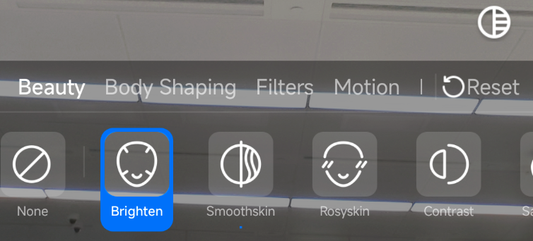
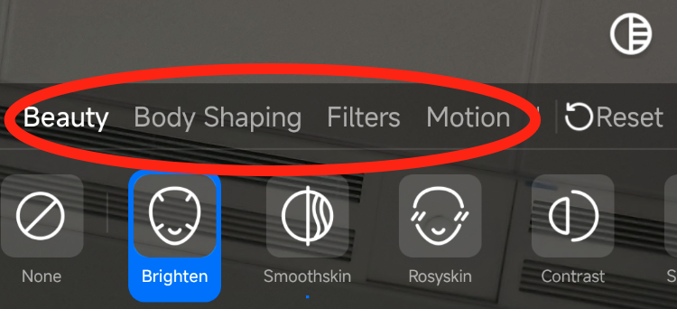
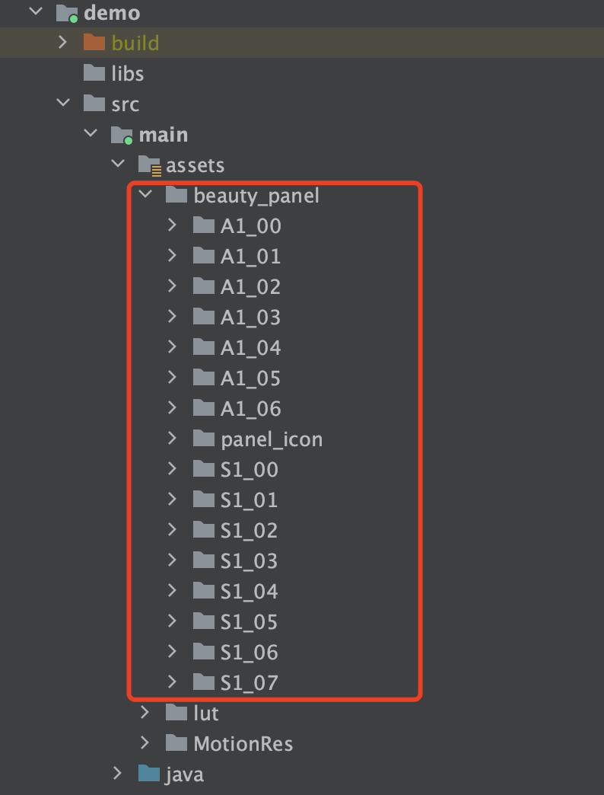

[简体中文](https://github.com/Tencent-RTC/TencentEffect_Android/blob/main/TEBeautyDemo/README_zh_CN.md)  |  English

# TEBeautyDemo

This project is a demo project for TencentEffectSDK, demonstrating how to integrate TencentEffectSDK with UI. The UI style is as follows.：

# Quick Start

- [Optional] Modify the SDK's package type and version number of TencentEffectSDK in `tebeautykit/build.gradle`. If not modified, the latest version of Maven for the S1_07 package will be used by default. To modify, change `api 'com.tencent.mediacloud:TencentEffect_S1-07:latest.release'` to the package and version number you are using, for example, `api 'com.tencent.mediacloud:TencentEffect_S1-07:3.6.0.4'`.
- Modify `LicenseConstant.java`: Set `mXMagicLicenceUrl` and `mXMagicKey` to the URL and Key you obtained from the Tencent Cloud Console.
- Modify `demo/build.gradle`, change `applicationId` to your app's package name, and ensure that the package name matches the license URL and Key in the previous step.
- Run the demo.

# Customize the Main Category

Different package type of TencentEffectSDK have different capabilities. For example, some packages do not have the "body shaping" feature, so the "body shaping" entry should not appear on the UI panel. To customize the main category, modify the `onInitApi` method in `TECameraBaseActivity.java`, and set the paths for beauty, body shaping, filters, and so on in `TEUIConfig.getInstance().setTEPanelViewRes` one by one. If you don't need a certain category, pass in `null` at the corresponding position.

The JSON configuration files for various beauty effects are located in the `assets/beauty_panel` directory of the demo project, as shown in the figure below. Please pass in the correct path in the `TEUIConfig.getInstance().setTEPanelViewRes` method. 

# Customize the List of Filters/Motions/Segmentation Materials.

The demo project comes with some filters and effect materials. If you have new materials to add, please follow the steps below to add them to the specified directory:

- To add a new filter: Put the filter image in the "demo/src/main/assets/lut" directory and the filter icon in the "demo/src/main/assets/beauty_panel/lut_icon" directory. Then modify the "demo/src/main/assets/beauty_panel/your_sdk_package_type/lut.json" file and add a new item following the existing items.
- To add a new motion/makeup/segmentation material: Put it in the subdirectories of "demo/src/main/assets/MotionRes", and put the icon in the "demo/src/main/assets/beauty_panel/motions_icon" directory. Then modify the `makeup.json` or `motions.json` or `segmentation.json` file under "demo/src/main/assets/beauty_panel/your_sdk_package_type".

# Customize the UI Style

In `TEUIConfig.java` of `tebeautykit`, there are several public `int` type color attributes. You can modify these color values to customize the background color, separator color, selected color, and so on of the beauty panel. If you need more in-depth customization, please modify the values of various layouts and drawables in `tebeautykit`.