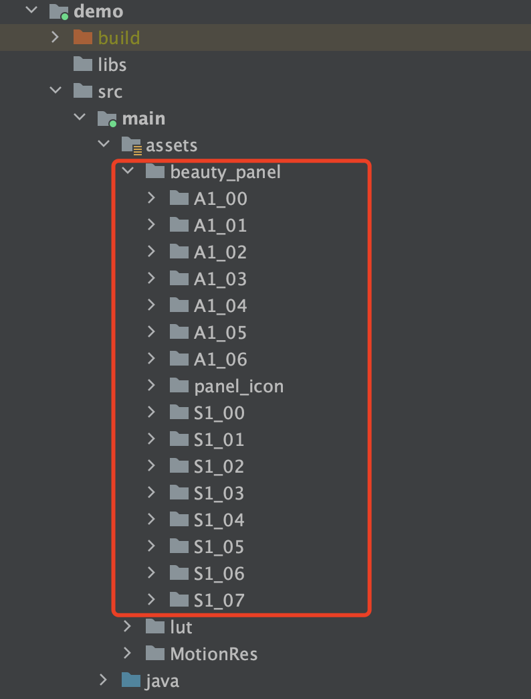

# TEBeautyDemo

本工程是 TencentEffectSDK 的 demo 工程，演示了如何带 UI 接入 TencentEffectSDK。UI样式如下：

# 快速开始

- 【可选】修改 tebeautykit/build.gradle 中的TencentEffectSDK的套餐和版本号。如果不修改，则默认使用S1_07套餐的Maven最新版本。如需修改，请将 api 'com.tencent.mediacloud:TencentEffect_S1-07:latest.release' 修改为你使用的套餐和版本号，例如 api 'com.tencent.mediacloud:TencentEffect_S1-07:3.6.0.4'
- 修改 LicenseConstant.java：将 mXMagicLicenceUrl 和 mXMagicKey 设置为你在腾讯云控制台申请到的 URL 和 Key。
- 修改 demo/build.gradle，将 applicationId 修改为你的包名，并确保该包名与上一步的 license url 和 Key 是匹配的。
- 运行 demo

# 自定义主分类

TencentEffectSDK的不同套餐具备不同的能力，例如某些套餐没有”美体“能力，那么 UI 面板上就不应该出现 ”美体“ 入口。自定义主分类请修改TECameraBaseActivity.java的onInitApi方法，在TEUIConfig.getInstance().setTEPanelViewRes中依次设置美颜、美体、滤镜等路径，如果不需要某一类，则在对应的位置传入null即可。

各类美颜的json配置文件位于demo工程的assets/beauty_panel目录，如下图所示，请在TEUIConfig.getInstance().setTEPanelViewRes方法中传入正确的路径。

# 自定义滤镜/动效/分割素材列表

demo工程中自带了一些滤镜和动效素材，如果你有新增的素材，请按如下方式添加到指定目录：

- 新增加滤镜：请将滤镜图片放到 "demo/assets/lut" 目录，滤镜icon放到 "demo/assets/beauty_panel/lut_icon"，然后修改 "demo/assets/beauty_panel/套餐名/lut.json"，参考已有的项目添加一项。
- 新增加动效/美妆/分割：请放到 "demo/assets/MotionRes"的各个子目录，图标请放到 "demo/assets/beauty_panel/motions_icon"，然后修改"demo/assets/beauty_panel/套餐名"下面的makeup.json或motions.json或segmentation.json。

# 自定义美颜面板样式

tebeautykit的TEUIConfig.java里有若干个public int类型的颜色属性，你可以修改这些颜色值来自定义美颜面板的背景色、分割线颜色、选中颜色等等。如果需要更深度的定制，请修改tebeautykit里各个layout和drawable的值。