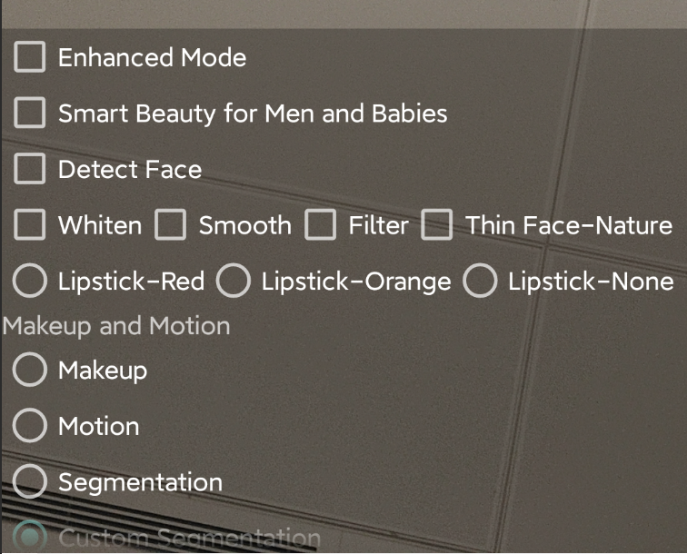

[简体中文](https://github.com/Tencent-RTC/TencentEffect_Android/blob/main/TEBeauty_API_Example/README_zh_CN.md)  |  English

# TEBeauty_API_Example

This project is a demo project for TencentEffectSDK, demonstrating how to integrate TencentEffectSDK without UI. It includes examples of multiple commonly used APIs. 

# Quick Start

- [Optional] Modify the package and version number of TencentEffectSDK in `demo/build.gradle`. If not modified, the latest version of Maven for the S1_07 package will be used by default. To modify, change `implementation 'com.tencent.mediacloud:TencentEffect_S1-07:latest.release'` to the package and version number you are using, for example, `implementation 'com.tencent.mediacloud:TencentEffect_S1-07:3.6.0.4'`.

- Modify `LicenseConstant.java`: Set `mXMagicLicenceUrl` and `mXMagicKey` to the URL and Key you obtained from the Tencent Cloud Console.

- Modify `demo/build.gradle`, change `applicationId` to your package name, and ensure that the package name matches the license URL and Key in the previous step.

- Run the demo.

# How to use other filters and motions？

The demo project comes with some filter and motion effect assets, located in the "demo/src/main/assets" directory. In the TEMenuActivity, these files are copied from the assets directory to the app's private directory (only needs to be done once). If you have additional assets, please add them to the lut or MotionRes directories under the assets directory, and then set the file path to the SDK when calling the "setEffect" method in the code.