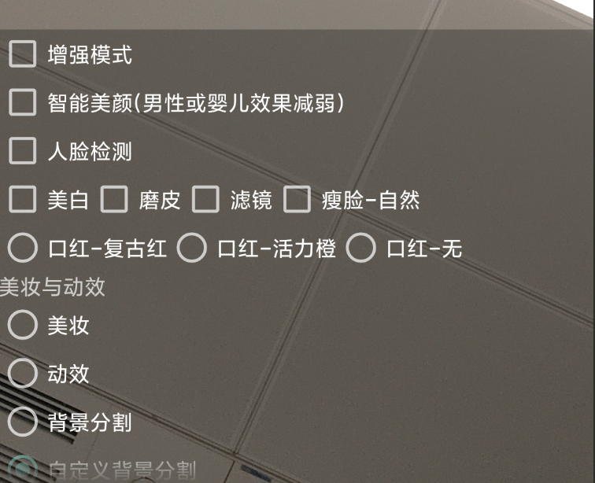

简体中文  |  [English](https://github.com/Tencent-RTC/TencentEffect_Android/blob/main/TEBeauty_API_Example/README.md)

# TEBeauty_API_Example

本工程是 TencentEffectSDK 的 demo 工程，演示了如何不带 UI 接入 TencentEffectSDK，里面包含了多个常用 API 的调用示例：

# 快速开始

- 【可选】修改 demo/build.gradle 中的TencentEffectSDK的套餐和版本号。如果不修改，则默认使用S1_07套餐的Maven最新版本。如需修改，请将 implementation 'com.tencent.mediacloud:TencentEffect_S1-07:latest.release' 修改为你使用的套餐和版本号，例如 implementation 'com.tencent.mediacloud:TencentEffect_S1-07:3.6.0.4'
- 修改 LicenseConstant.java：将 mXMagicLicenceUrl 和 mXMagicKey 设置为你在腾讯云控制台申请到的 URL 和 Key。
- 修改 demo/build.gradle，将 applicationId 修改为你的包名，并确保该包名与上一步的 license url 和 Key 是匹配的。
- 运行 demo

# 如何使用其他的滤镜和动效？

demo工程中自带了一些滤镜和动效素材，位于demo/src/main/assets目录，在TEMenuActivity里会把这些文件从assets目录拷贝到app私有目录（只需要拷贝一次）。如果你有新增加的素材，请添加到assets目录下的lut或MotionRes，然后在代码中setEffect时将素材路径设置给SDK即可。