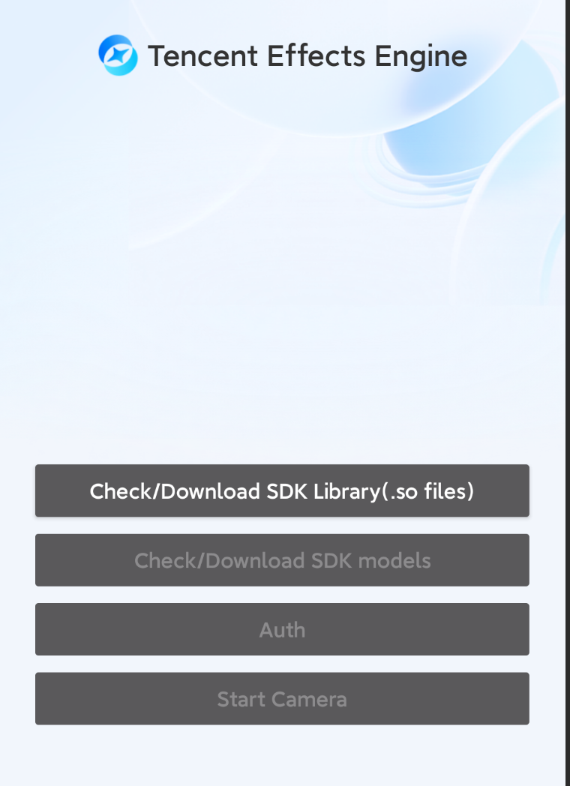

[简体中文](https://github.com/Tencent-RTC/TencentEffect_Android/blob/main/TEBeauty_Download_Example/README_zh_CN.md)  |  English

# TEBeauty_Download_Example

This is a demo project for TencentEffectSDK, demonstrating how to dynamically download SDK library files and model files, how to integrate the SDK after successful download, and examples of common API calls. Integrating the SDK through this dynamic download scheme can reduce the size of the apk package.

# Quick Start

- [Download the latest SDK](https://www.tencentcloud.com/document/product/1143/45377) from the Tencent Cloud official website, extract it, then find the .zip compressed file from the "SDK" directory, and extract it again. You will see the following files.

  

- Copy the `xmagic-xxx.aar` file to the `demo/libs` directory, replacing the existing AAR file.

- Upload the `download_assets.zip`, `arm64-v8a.zip`, and `armeabi-v7a.zip` files to your server and obtain the download URLs. Also, calculate the MD5 checksum for these three ZIP files. Fill in the corresponding constants in `ResDownloadConfig.java` with the download URLs and MD5 values.

- Modify `LicenseConstant.java`: Set `mXMagicLicenceUrl` and `mXMagicKey` to the URL and Key you obtained from the Tencent Cloud console.

- Modify `demo/build.gradle` and change the `applicationId` to your package name. Make sure that the package name matches the license URL and Key from the previous step.

- Run the demo

# Points to Note

The demo by default has the resume-from-breakpoint feature enabled, which ensures that if the download is interrupted unexpectedly, it will continue from the breakpoint next time. If you also want to enable the resume-from-breakpoint feature, please make sure your download server supports this capability.

To determine whether the server supports resume-from-breakpoint, check if the Web server supports Range requests. The test method is to execute the curl command in the command line:

curl -i --range 0-9 https://your_server_address/filename_to_be_downloaded

For example:

curl -i --range 0-9 https://mediacloud-76607.gzc.vod.tencent-cloud.com/TencentEffect/Android/2.4.1.119/xmagic_S1-04_android_2.4.1.119.zip

If the returned content includes the Content-Range field, it means the server supports resume-from-breakpoint.