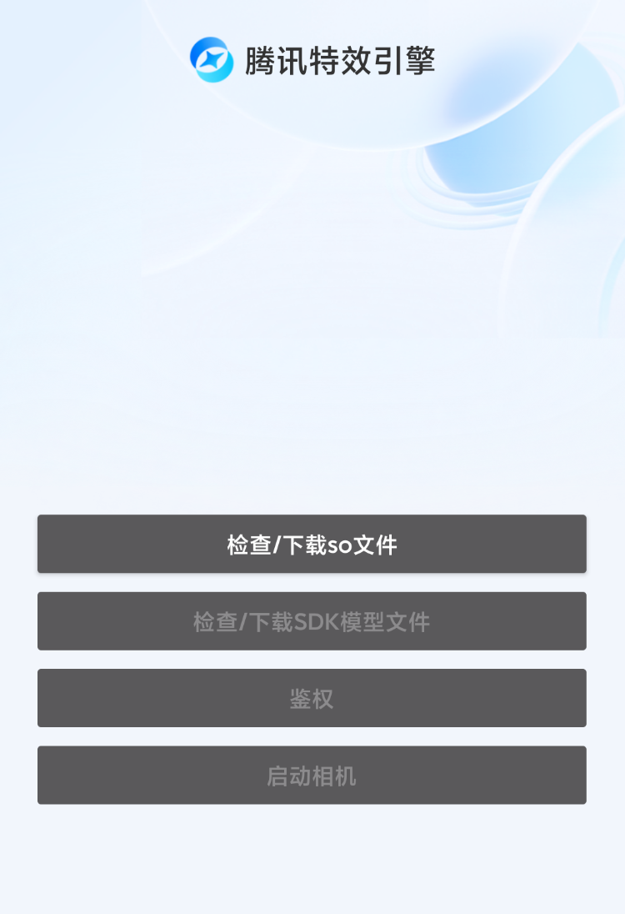
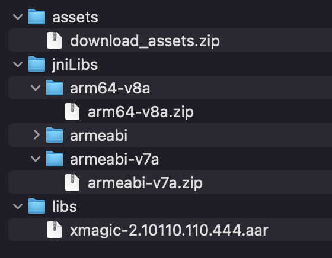

简体中文  |  [English](https://github.com/Tencent-RTC/TencentEffect_Android/blob/main/TEBeauty_Download_Example/README.md)

# TEBeauty_Download_Example

本工程是 TencentEffectSDK 的 demo 工程，演示了如何动态下载SDK的库文件和模型文件、下载成功后如何集成SDK、以及常用API的调用示例。通过这种动态下载方案集成SDK，可以减少安装包大小。

# 快速开始

- 从[腾讯云官网](https://cloud.tencent.com/document/product/616/65876)下载最新的SDK，解压，然后从"SDK"目录找到.zip格式的压缩包，再次解压，你将看到如下文件：

  

- 将xmagic-xxx.aar拷贝到demo/libs目录，替换其中旧的aar

- 将download_assets.zip, arm64-v8a.zip, armeabi-v7a.zip 上传到你的服务器，得到下载地址。同时计算出这3个zip文件的MD5。将这3个下载地址和MD5填在 ResDownloadConfig.java 里对应的常量上

- 修改 LicenseConstant.java：将 mXMagicLicenceUrl 和 mXMagicKey 设置为你在腾讯云控制台申请到的 URL 和 Key。

- 修改 demo/build.gradle，将 applicationId 修改为你的包名，并确保该包名与上一步的 license url 和 Key 是匹配的。

- 运行 demo

# 注意事项

Demo 中默认是开启断点续传功能的，可以确保在下载异常中断后，下次继续从中断点接着下载。如果您也想开启断点续传，请确保您的下载服务器支持断点续传能力。 

判断服务器是否支持断点续传，看Web服务器是否支持Range请求即可。测试方法是在命令行中执行curl命令：

curl -i --range 0-9 https://您的服务器地址/待下载的文件名

例如：

curl -i --range 0-9 https://mediacloud-76607.gzc.vod.tencent-cloud.com/TencentEffect/Android/2.4.1.119/xmagic_S1-04_android_2.4.1.119.zip

如果返回的内容有Content-Range 字段，则表示服务器支持断点续传。